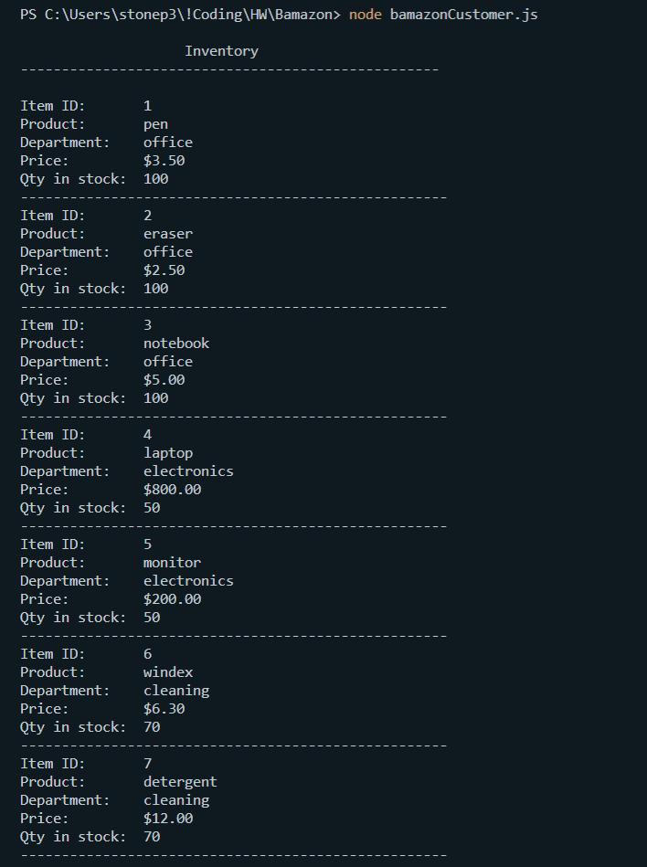
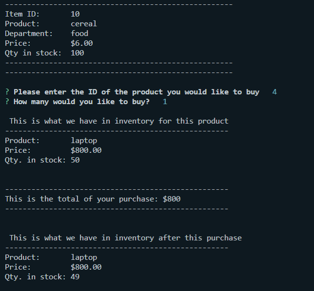
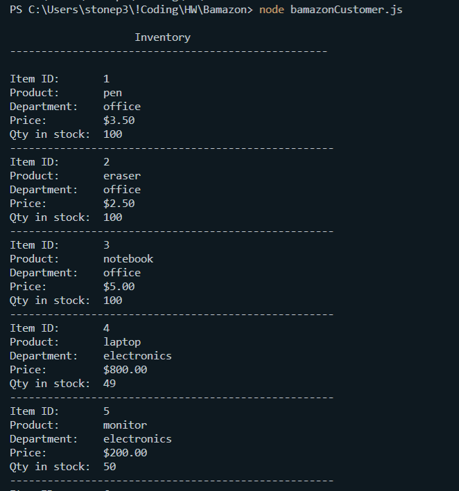

# Bamazon
Bamazon (Customer solution) allows users to see the inventory of products available for purchase, then it request for information about product ID and quantity they want to purchase.
Once the inforamtion is validated, the database is updated and the user receives a message with total amount to pay.

## How it works?
At the termnal prompt just type **node bamazonCustomer.js**
The app will run automatically after that.

## 

#### 1. Run node bamazonCustomer.js to start the app and display inventory

#### 2. Once inventory is display, Bamazon requests the user to enter product ID and number of items he/she wants to buy. The app will display information about the item selected, the total amoutn the user will have to pay, and the updated quantity for the item purchased.

#### 3. Restarting the app will show the updated quantity for item previously pruchased.

## Technology
This project was built with JavaScript, Node, MySQL
